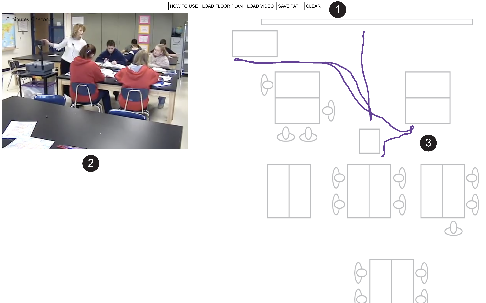

# Mondrian Transcription Software

Hi there! This is a repository for Mondrian Transcription Software, an open-source tool to transcribe fine-grained movement data from video by efficiently tracing the movement of people or things over floor plan representations to generate text files of positioning data — essentially, a transcript of movement.

Mondrian Transcription features:

- **Browser-based:** Everything in your browser.
- **Movement transcription from video:** One of only a handful of tools built to manually transcribe movement from video.
- **Movement transcription at different scales:** Transcribe movement at the scale of gesture, classroom interaction, or larger scales.
- **Meaningful and efficient transcription:** Features such as fast-forwarding and re-winding provide meaningful and efficient ways to qualitatively transcribe movement data that are lost with automated methods.
- **Visualize movement transcription output:** Output data files can be visualized in software such as the [Interaction Geography Slicer](https://www.benrydal.com/software/igs).
- **Future features:** We are rapidly developing and expanding features and collaborators in this effort are welcome.

## Get started

- For more information on how to use this tool, please visit [Mondrian Transcription](https://www.benrydal.com/software/mondrian-transcription)

## Reporting bugs & contributing code

- We are rapidly developing and expanding features of this tool and collaborators in this effort are welcome. If you have found a bug, you can file it under the “issues” tab. You can also request new features here.

## Credits

This work is supported by the National Science Foundation. Classroom science lesson data is made possible by the researchers and teachers who created The Third International Mathematics and Science Study (TIMSS) 1999 Video Study. Mondrian Transcription software was originally developed by Ben Rydal Shapiro at Vanderbilt University as part of his dissertation titled Interaction Geography & the Learning Sciences. Copyright (C) 2018 Ben Rydal Shapiro, and contributors. To reference or read more about this work please see [HERE](https://etd.library.vanderbilt.edu/available/etd-03212018-140140/unrestricted/Shapiro_Dissertation.pdf)

## License

This software is written in JavaScript and p5.js and licensed under the GNU General Public License Version 2.0. See the GNU General Public License included with this software for more details.
