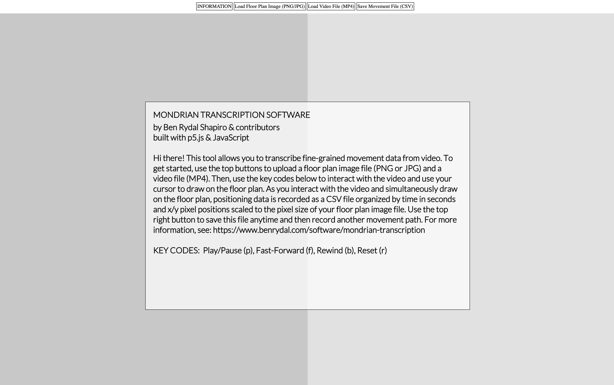

# Mondrian Transcription Software

## Overview
Hi there! This is a repository for Mondrian Transcription Software, an open-source tool to transcribe fine-grained movement data from video by efficiently tracing the movement of people or things over floor plan representations to generate text files of positioning data — essentially, a transcript of movement. These files can be visualized in software such as the [Interaction Geography Slicer](https://www.benrydal.com/software/igs). We are rapidly developing and expanding features of this tool and collaborators in this effort are welcome. If you have found a bug, you can file it under the “issues” tab. You can also request new features here. For more information on how to use this tool, please visit [Mondrian Transcription](https://www.benrydal.com/software/mondrian-transcription)

## Credits/License Information 
This software is written in JavaScript and p5.js. This software is licensed under the GNU General Public License Version 2.0. See the GNU General Public License included with this software for more details. Mondrian Transcription software was originally developed by Ben Rydal Shapiro at Vanderbilt University as part of his dissertation titled Interaction Geography & the Learning Sciences. Copyright (C) 2018 Ben Rydal Shapiro, and contributors. To reference or read more about this work please see [HERE](https://etd.library.vanderbilt.edu/available/etd-03212018-140140/unrestricted/Shapiro_Dissertation.pdf)