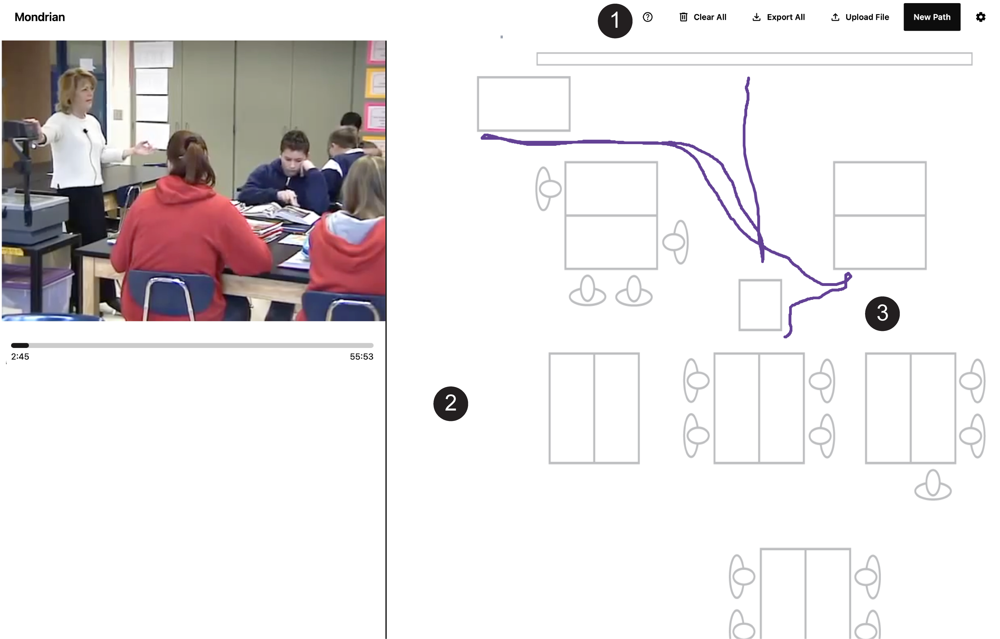

# Mondrian Transcription Software



Welcome to **Mondrian Transcription!** This is an open-source tool that allows you to transcribe fine-grained movement data from video by efficiently tracing the movement of people or things over floor plan representations to generate text files of positioning data — essentially, a transcript of movement. This tool runs entirely in your browser. No files are uploaded, stored, or transmitted—your data stays on your device at all times.

## Get started

- **Visit**: https://www.interactiongeography.org

## Mondrian Transcription features:

- **Browser-based:** Everything in your browser.
- **Movement transcription from video:** One of only a handful of tools built to manually transcribe movement from video.
- **Movement transcription at different scales:** Transcribe movement at the scale of gesture, room, or larger scales.
- **Meaningful and efficient transcription:** Features such as fast-forwarding and re-winding provide meaningful and efficient ways to qualitatively transcribe movement data.
- **Visualize movement transcription output:** Output data files can be visualized in software such as the [Interaction Geography Slicer](https://www.interactiongeography.org).
- **Future features:** We are rapidly developing and expanding features and collaborators in this effort are welcome.

## Frameworks and Libraries

- **Svelte**: A lightweight and powerful framework for building fast, interactive web applications.
- **Papa Parse**: Used for fast CSV data parsing in JavaScript.
- **p5.js**: For generating the custom visualizations of movement and conversation.
- **Tailwind CSS**: For visually appealing user interface.

## Installation & Setup

1. Clone the repository:

    ```bash
    git clone https://github.com/yourusername/mondrian-transcription.git
    ```

2. Navigate to the project directory:

    ```bash
    cd mondrian-transcription
    ```

3. Install dependencies:

    ```bash
    yarn install
    ```

4. Start the development server:

    ```bash
    yarn dev
    ```

5. Visit `http://localhost:5000` in your browser to see the tool in action.

## Contribute

We welcome contributions! If you'd like to contribute, please follow the contribution guidelines and open a pull request. For major changes, please open an issue first to discuss what you would like to change.

## License

This software is written in JavaScript and p5.js and licensed under the GNU General Public License Version 3.0. See the GNU General Public License included with this software for more details.

## Credits

Mondrian Transcription is an open-source project built with Svelte, JavaScript, and p5.js. It is developed by Ben Rydal Shapiro, Edwin Zhao, and contributors, with support from the National Science Foundation (#1623690, #2100784). If using Mondrian Transcription in your work, kindly reference: Shapiro, B.R., Hall, R. and Owens, D. (2017). Developing & Using Interaction Geography in a Museum. International Journal of Computer-Supported Collaborative Learning, 12(4), 377-399. https://doi.org/10.1007/s11412-017-9264-8
