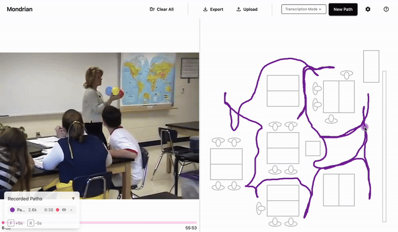

# Mondrian Transcription



**A browser-based tool for transcribing movement from video or speculating about how people move through space.**

[](https://www.gnu.org/licenses/gpl-3.0)


---

## Quick Start

**Use it now:** [interactiongeography.org](https://www.interactiongeography.org)

No installation required—runs entirely in your browser.

---

## Table of Contents

- [Features](#features)
- [Two Modes](#two-modes)
- [Keyboard Shortcuts](#keyboard-shortcuts)
- [Output Format](#output-format)
- [Local Development](#local-development)
- [Tech Stack](#tech-stack)
- [Contributing](#contributing)
- [Citation](#citation)
- [License](#license)

---

## Features

- **Fully Browser-Based** — No server uploads. Your video and data never leave your device.
- **Video-Synced Transcription** — Draw paths while video plays; points are timestamped to playback time.
- **Multi-Scale Support** — Works for gesture-level, room-level, or building-level movement.
- **Multiple Paths** — Track multiple people or objects with color-coded paths.
- **Smart Sampling** — Adaptive sampling reduces file size while preserving movement detail.
- **Session Recovery** — Auto-saves your work to prevent data loss from browser crashes.
- **Flexible Export** — Download a ZIP containing CSVs for each path plus your floor plan.

---

## Two Modes

### Transcription Mode

For transcribing movement from video. Load a video and floor plan side-by-side, then trace movement as the video plays. Points are timestamped to video playback time.

### Speculate Mode

For sketching movement without video. Load only a floor plan and draw paths freely. Useful for imagining how people or things could move, planning, and hypothetical scenarios, or working from memory.

---

## Keyboard Shortcuts

| Key     | Action                                   |
| ------- | ---------------------------------------- |
| `F`     | Fast-forward 5 seconds                   |
| `R`     | Rewind 5 seconds                         |
| `←` `→` | Fine scrub (when video controls focused) |

---

## Output Format

Export produces a ZIP file containing:

- One CSV per path with columns: `x`, `y`, `time`
- Your floor plan image (PNG)

Output is compatible with visualization tools like the [Interaction Geography Slicer](https://www.interactiongeography.org).

---

## Local Development

<details>
<summary>Click to expand installation steps</summary>

1. **Clone the repository**

   ```bash
   git clone https://github.com/BenRydal/mondrian-transcription.git
   cd mondrian-transcription
   ```

2. **Install dependencies**

   ```bash
   yarn install
   ```

3. **Start the development server**

   ```bash
   yarn dev
   ```

4. **Open** `http://localhost:5173` in your browser

### Other Commands

```bash
yarn build    # Production build
yarn check    # Type-check Svelte components
yarn lint     # Run ESLint + Prettier
yarn format   # Auto-format code
```

</details>

---

## Tech Stack

<details>
<summary>Click to expand</summary>

| Technology                                                               | Purpose         |
| ------------------------------------------------------------------------ | --------------- |
| [Svelte 5](https://svelte.dev) + [SvelteKit 2](https://kit.svelte.dev)   | UI framework    |
| [TypeScript](https://www.typescriptlang.org)                             | Type safety     |
| [p5.js](https://p5js.org)                                                | Canvas drawing  |
| [Tailwind CSS](https://tailwindcss.com) + [DaisyUI](https://daisyui.com) | Styling         |
| [Papa Parse](https://www.papaparse.com)                                  | CSV handling    |
| [fflate](https://github.com/101arrowz/fflate)                            | ZIP compression |

</details>

---

## Contributing

Contributions are welcome! Please open an issue first to discuss major changes. For bug fixes and minor improvements, feel free to open a pull request directly.

---

## Citation

If you use Mondrian Transcription in your research, please cite:

> Shapiro, B.R., Hall, R. and Owens, D. (2017). Developing & Using Interaction Geography in a Museum. _International Journal of Computer-Supported Collaborative Learning_, 12(4), 377-399.
> https://doi.org/10.1007/s11412-017-9264-8

---

## License

GNU General Public License v3.0 — see [LICENSE](LICENSE) for details.

---

## Credits

Developed by **Ben Rydal Shapiro**, **Edwin Zhao**, and contributors.

Supported by the National Science Foundation (#1623690, #2100784).
