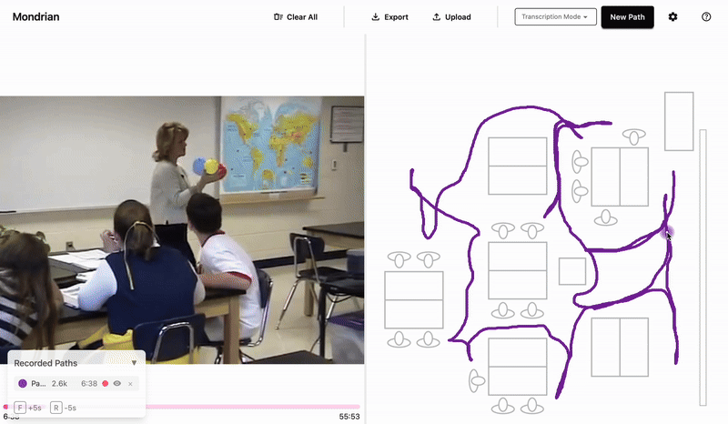

<h1 align="center">Mondrian Transcription</h1>

<p align="center"><strong>A browser-based tool for transcribing movement from video or speculating about how people move through space.</strong></p>

<p align="center">
  <a href="https://www.gnu.org/licenses/gpl-3.0"></a>
  
  
</p>

<p align="center">
  <a href="https://mondrian.interactiongeography.org">Live Demo</a> ·
  <a href="https://www.youtube.com/watch?v=mgbNzikyucQ">Watch Video</a> ·
  <a href="https://github.com/BenRydal/mondrian-transcription/issues">Report Bug</a> ·
  <a href="https://github.com/BenRydal/mondrian-transcription/issues">Request Feature</a>
</p>

<p align="center">
  
</p>

---

## Quick Start

**Use it now:** [interactiongeography.org](https://www.interactiongeography.org)

No installation required—runs entirely in your browser.

---

## Table of Contents

- [Features](#features)
- [Two Modes](#two-modes)
- [Sessions, Autosave and History](#sessions-autosave-and-history)
- [Keyboard Shortcuts](#keyboard-shortcuts)
- [Output Format](#output-format)
- [Local Development](#local-development)
- [Tech Stack](#tech-stack)
- [Contributing](#contributing)
- [Citation](#citation)
- [License](#license)

---

## Features

- **Fully Browser-Based** — No server uploads. Your video and data never leave your device.
- **Video-Synced Transcription** — Draw paths while video plays; points are timestamped to playback time. Works with local video files and the built-in YouTube examples.
- **Example Videos** — Start from built-in sports, museum and classroom videos with matching floor plans.
- **Playback Control** — Slow down or speed up playback (0.25×–2×), step frame by frame, and jump forward or back.
- **Click or Hold to Draw** — Click to start and stop tracing, or hold the pointer down and let go to pause (Settings → Recording).
- **Multi-Scale Support** — Works for gesture-level, room-level, or building-level movement.
- **Multiple Paths** — Track multiple people or objects with color-coded, renamable paths, with optional trails for the other paths.
- **3D Space-Time View** — Turn on 3D in the top bar to watch paths rise through time above the floor plan while you draw.
- **Frame-Rate Independent Timing** — Points are timestamped from pointer events on one session clock and exported on a shared time grid.
- **Autosave, Checkpoints and Sessions** — Work is saved in the browser as you go, with named checkpoints, earlier versions, per-path restore and multiple sessions.
- **Flexible Export** — Download a ZIP containing a CSV for each path plus your floor plan, ready for the Interaction Geography Slicer.
- **Re-open an Export** — Drop an exported ZIP, or loose path CSVs with a floor plan, back on the Data panel and keep tracing on top of them.

---

## Two Modes

### Transcription Mode

For transcribing movement from video. Load a video (a local file, or one of the example videos in the Data panel) and a floor plan side-by-side, then trace movement as the video plays. Points are timestamped to video playback time.

### Speculate Mode

For sketching movement without video. Load only a floor plan and draw paths freely. Useful for imagining how people or things could move, planning, and hypothetical scenarios, or working from memory.

---

## Sessions, Autosave and History

Mondrian saves your work in the browser (IndexedDB) while you draw, so a crash or closed tab doesn't lose it. When you come back, it offers to restore your last session.

The **History** panel holds:

- **Session** — switch between sessions, rename or delete them, and export a session's full history as a ZIP to move it to another browser or computer. **Import session** accepts either kind of export, as does the Data panel.
- **Versions & checkpoints** — autosaved versions plus checkpoints you create yourself (`Ctrl/⌘ S`). Mondrian also saves a checkpoint before risky actions such as Clear All or restoring an older version. You can restore a whole version, or restore a single path either in place or as a new path.

Only one tab can edit a session at a time. If you open Mondrian in a second tab, that tab pauses so it can't overwrite your work. Close the first tab and the second one continues with its latest work, or choose **Start a new session here** to work on something else in parallel.

Everything stays on your device. To keep work somewhere else, use **Export** or **Export history**.

---

## Keyboard Shortcuts

| Key         | Action                                          |
| ----------- | ----------------------------------------------- |
| `F`         | Jump forward (5 s with video, 1 s in Speculate) |
| `R`         | Jump back (5 s with video, 1 s in Speculate)    |
| `S`         | Pause or resume the 3D spin                     |
| `←` `→`     | Step one frame while paused (video)             |
| `Shift ←/→` | Step one second while paused (video)            |
| `[` `]`     | Slower / faster playback (video)                |
| `Ctrl/⌘ S`  | Save a checkpoint                               |

Jump lengths can be changed under Settings.

---

## Output Format

Export gives you a ZIP holding one CSV per path plus your floor plan (`floor-plan.png`).

Each CSV has three columns: `x`, `y` and `time`. The coordinates are pixels on the floor plan, and the time is in seconds, sampled ten times a second by default (change it under Settings → Sampling).

Each file is named after its path, so `Teacher.csv`, or `path-2.csv` if you never named it. The [Interaction Geography Slicer](https://www.interactiongeography.org) treats that file name as the person's name and matches it to speakers in a transcript — so name your paths the way the speakers appear there. Two paths with the same name become `Teacher.csv` and `Teacher-2.csv`.

In Speculate mode, export asks how long the session should be. Keep the default to export the timings you drew, or enter a different total to stretch or squeeze every path to fit.

### Importing

Drop an export back onto the **Data** panel, or switch that panel to **Open existing** and use **Import paths & floor plan**. Mondrian works out which kind it is: a session archive opens as a new session, and a data export replaces the floor plan and paths in the session you are in. Either way a checkpoint is saved first, so you can undo it from History.

You can also pick the files directly instead of a ZIP — any number of CSVs, plus one image for the floor plan.

What happens next:

- **Your imported paths become a backdrop.** Recording starts a new, empty path on top of them, so you can trace another person without touching what you imported.
- **Times are read for the mode you are in** — video seconds in Transcription mode, session seconds in Speculate mode.
- **In Transcription mode you need the video back** before you can record. Mondrian shows a prompt asking for it.
- **If the floor plan is the wrong one**, the paths land in the wrong place and Mondrian says so. Import again with the right image to replace both. Use import rather than the **Floor Plan** button, which deletes your paths in Speculate mode.

Writing your own CSVs works too. The header is optional, `x`, `y` and `time` can be in any order, extra columns are ignored, and bad rows are skipped. Keep values unquoted, as commas inside quotes are not understood. Round-tripping is slightly lossy, since export rounds coordinates and puts times on an even grid.

---

## Local Development

<details>
<summary>Click to expand installation steps</summary>

1. **Clone the repository**

   ```bash
   git clone https://github.com/BenRydal/mondrian-transcription.git
   cd mondrian-transcription
   ```

2. **Install dependencies**

   ```bash
   yarn install
   ```

3. **Start the development server**

   ```bash
   yarn dev
   ```

4. **Open** `http://localhost:5173` in your browser

### Other Commands

```bash
yarn build    # Production build
yarn test     # Unit tests
yarn check    # Type-check Svelte components
yarn lint     # Run ESLint + Prettier
yarn format   # Auto-format code
```

</details>

---

## Tech Stack

<details>
<summary>Click to expand</summary>

| Technology                                                               | Purpose         |
| ------------------------------------------------------------------------ | --------------- |
| [Svelte 5](https://svelte.dev) + [SvelteKit 2](https://kit.svelte.dev)   | UI framework    |
| [TypeScript](https://www.typescriptlang.org)                             | Type safety     |
| [p5.js](https://p5js.org)                                                | Canvas drawing  |
| [Tailwind CSS](https://tailwindcss.com) + [DaisyUI](https://daisyui.com) | Styling         |
| [fflate](https://github.com/101arrowz/fflate)                            | ZIP compression |

</details>

---

## Contributing

Contributions are welcome! Please open an issue first to discuss major changes. For bug fixes and minor improvements, feel free to open a pull request directly.

---

## Citation

If you use Mondrian Transcription in your research, please cite:

> Shapiro, B. R., Silvis, D., & Hall, R. (2025). Visualization as theory and experience: Interactive qualitative data visualization for the learning sciences. _Journal of the Learning Sciences, 34_(5), 840–871. https://doi.org/10.1080/10508406.2025.2537945

<details>
<summary>BibTeX</summary>

```bibtex
@article{shapiro2025visualization,
  title={Visualization as theory and experience: Interactive qualitative data visualization for the learning sciences},
  author={Shapiro, Ben Rydal and Silvis, Deborah and Hall, Rogers},
  journal={Journal of the Learning Sciences},
  volume={34},
  number={5},
  pages={840--871},
  year={2025},
  publisher={Taylor \& Francis},
  doi={10.1080/10508406.2025.2537945}
}
```

</details>

---

## License

GNU General Public License v3.0 — see [LICENSE](LICENSE) for details.

---

## Credits

Developed by **Ben Rydal Shapiro**, **Edwin Zhao**, and contributors.

Supported by the National Science Foundation (#1623690, #2100784).
